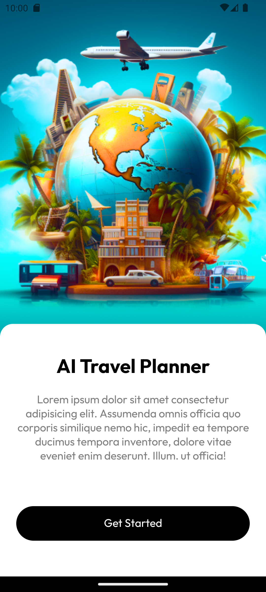
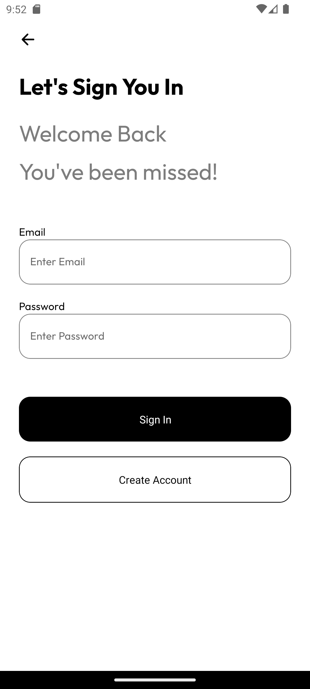
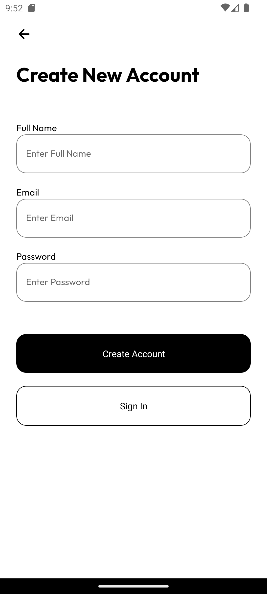
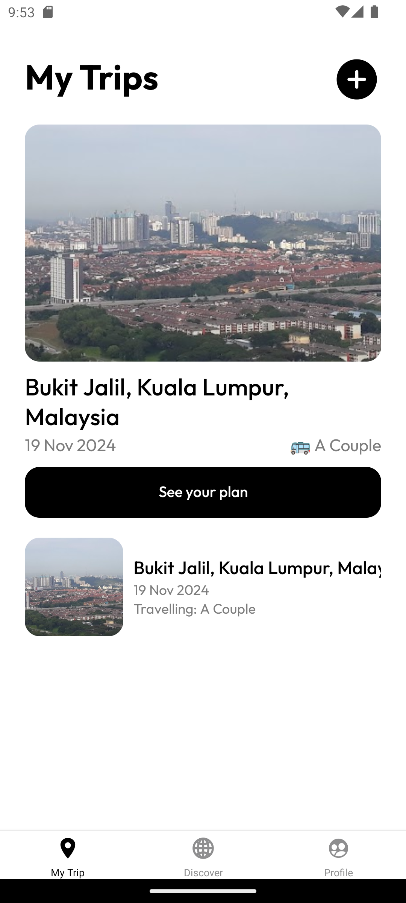
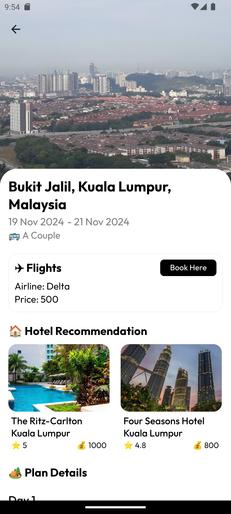

# Notes
(For teammates taking Capstone Project)
## Initial Available Features
### 1. Get Started
Get started page.

### 2. Login and Signup
Login and signup page.
- Provider: Firebase Auth, Firestore Database

### 3. My Trips
Show trips generated by Gemini AI
- Provider: Google Gemini AI

### 4. Show Generated Trip
Show details of the generated trip, with flight, hotel recommendation, and plan details
- Provider: Google Maps Platform, Google Places API

## Differences
### 1. code implementation
You may find some differences on implementation of functions compared to what in tutorial because I try to use TypeScript and some different logics that is easier to understand and debug

### 2. format for AI generated travel plan
Although I used the exact(I guess) the same prompt as the tutorial, however the output still have some differences in format. Therefore, you may find different attributes and code compared to tutorial.

## Issue
### 1. There are some issues when generating new plan when I writing this note, which says Gemini model not available